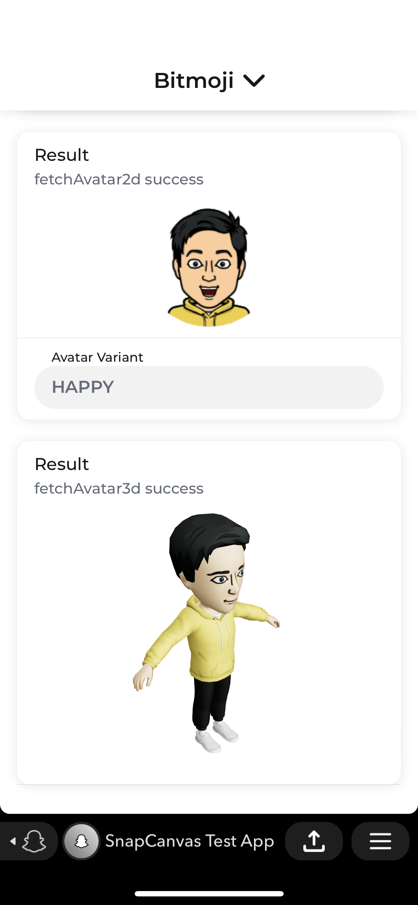

# Sample

The Sample Mini is provides a full example of how to use the SDK. Although it's written in React, the example code applies to any JS framework.

<p align="center">

</p>

### Development and Testing

In order to run the following building and releasing commands, you will need to download the CLI tool snapdev, which can be found in
https://docs.snap.com/minis/reference/cli-reference

Some useful commands:

```
yarn start                               # run with hot reload on localhost:3000 and the local network

yarn minis:build                        # create a development build with the version `$(git username short).$(time in s)`
yarn minis:release -b <build id>        # create a release from that build with the name `$(git username short).$(time in s)`

yarn rapid:host                          # see the local network host for rapid deployment
yarn minis:build-rapid                   # create a rapid development build with the version  `rapid.$(git username short).$(time in s)`
yarn minis:release-rapid -b <build id>   # create a release from the that build with the name `rapid.$(git username short).$(time in s)`

yarn minis:target -r <release> -u <Snapchat usernames>
```

Note that the above commands can be run from the root directory of the repo using workspace, such as:

```
yarn workspace @snapchat/minis-sample minis:build
```

The sample uses a file ref to `packages/minis` to allow for quick testing of `@snapchat/minis-sdk`.

Typically, when you make a local change to the Minis SDK, the best way to test that change in the Minis Sample would be to run the following from the root directory of the minis-sdk repo.

```
yarn workspace @snapchat/minis-sdk run build          # build the minis SDK
rm -rf minis/sample/node_modules/@snapchat            # make sure this is gone, so we are referring to root node_modules symlink
yarn workspace @snapchat/minis-sample run start       # start the sample
```

### Layout

Each component of ths SDK has its own route and page.

```
/ads
/auth
/bitmoji
/leaderboards
/localstorage
/permissions
/realtime
/sharing
/shortcut
/social
/storage
/tokens
/updates
```

`/*` routes to a root page that prints the current fields of the Mini and has forms to test `logEvent` and the methods directly on `Mini`.

### Bitmoji

A random test avatar id will be used each time the Sample loads.

### Troubleshooting

- [RemoteJS](https://remotejs.com/) can be used to debug the webview on development builds. Add the script to the `public/index.html` to use it.

### Resources

- [React](https://reactjs.org/docs/hooks-intro.html)
- [React Router](https://reactrouter.com/docs/en/v6/getting-started/concepts#matching)
